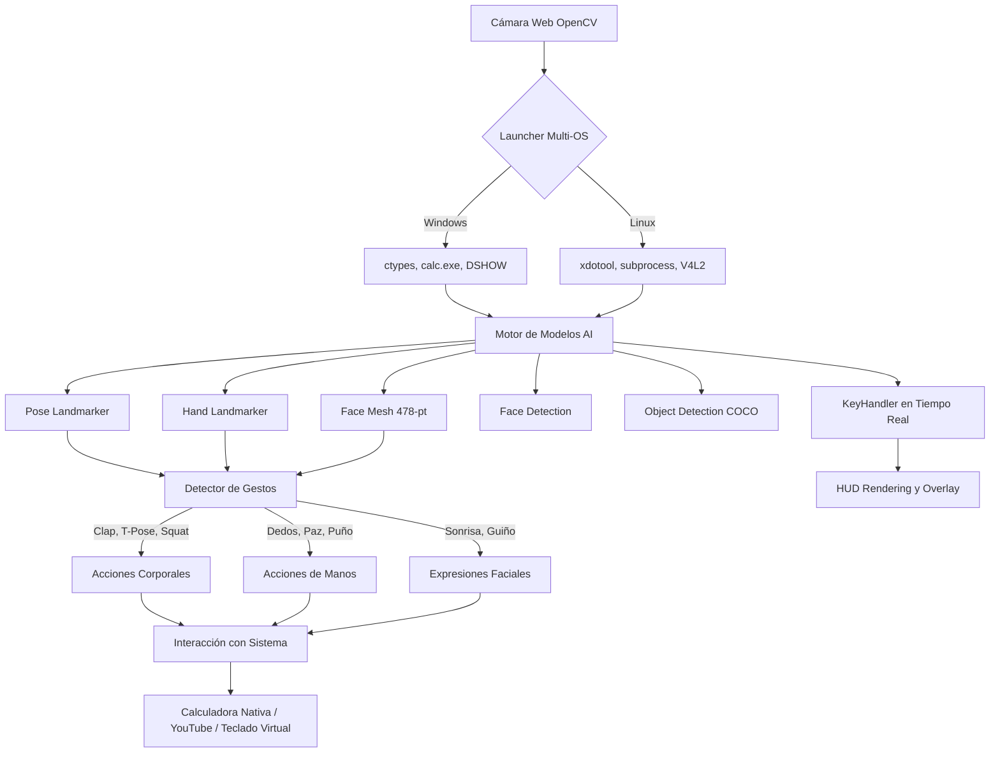

# LookThePerson

<div align="center">

</pre>

**Framework Avanzado de Control Multi-Plataforma por Visión Computarizada y Gestos**

[](https://www.python.org/)
[](https://www.linux.org/)
[](https://developers.google.com/mediapipe)
[](https://opencv.org/)

</div>

---

## 👁️ Descripción General

**LookThePerson** es un framework de visión por computadora que convierte tu cámara web en una interfaz de control en tiempo real. Utilizando hasta **5 modelos distintos de IA** (MediaPipe), el programa rastrea simultáneamente tu cuerpo, manos, rostro y objetos en el entorno.

Lo que comenzó como un pequeño script para Windows se ha transformado en un sistema **cross-platform (Windows y Linux)** altamente interactivo. Permite activar funciones, cambiar modelos sobre la marcha y usar gestos físicos para controlar aplicaciones nativas, todo desde una interfaz HUD futurista sobrepuesta en tu cámara.

---

##  Demostración de Interfaz

<p align="center">
  
</p>

---

##  Arquitectura y Flujo



---

##  Modelos de Inteligencia Artificial Integrados

La herramienta descarga automáticamente estos modelos en el primer arranque:

| Modelo MediaPipe | Propósito | Características Extra |
| :--- | :--- | :--- |
| **Pose Landmarker** | Esqueleto corporal completo | Segmentación de silueta con tintado dinámico |
| **Hand Landmarker** | Seguimiento de 21 puntos por mano | Conteo de dedos y reconocimiento de signos |
| **Face Mesh** | Malla facial 3D de 478 puntos | Detección de expresiones y rastreo de iris/mirada |
| **Face Detection** | Detección rápida de rostros | Bounding boxes y 6 puntos clave (ojos, nariz, boca) |
| **Object Detection** | Reconocimiento de entorno | 80 clases COCO con colores categorizados |

---

##  Controles en Tiempo Real (Teclado)

Puedes activar y desactivar funciones al instante **mientras la cámara está encendida**:

> [!TIP]
> **Modos de Configuración Rápida:** Usa los números del `1` al `4` para cambiar el perfil de los modelos activos de golpe (Ej: `1` = Todo activo, `4` = Solo Cara).

| Tecla | Acción / Toggle | Tecla | Acción / Toggle |
| :---: | :--- | :---: | :--- |
| `M` | Alternar máscara de **Segmentación** corporal | `S` | Tomar **Screenshot** (Captura PNG) |
| `F` | Activar/Desactivar **Face Mesh** overlay | `R` | Iniciar/Parar **Grabación de Video** |
| `O` | Activar/Desactivar **Detección de Objetos** | `C` | Cambiar color del esqueleto (Random) |
| `D` | Activar/Desactivar **Detección Rápida de Caras**| `X` | Bloquear/Desbloquear control de Calculadora |
| `G` | Mostrar/Ocultar **Cuadrícula de Referencia** | `+ / -` | Ajustar confianza de detección de objetos |
| `H` | Alternar el **Panel HUD de Ayuda** lateral | `1 - 4` | Cambiar Modos (Completo/Pose/Manos/Cara)|
| `T` | Mostrar/Ocultar texto de **Telemetría** inferior | `Q / Esc` | **Salir** del programa de forma segura |
| `N` | Activar/Desactivar **Modo Nocturno** (Inverso)| `B` | Ocultar/Mostrar **Bounding Boxes** |

---

##  Gestos Físicos Mapeados

El sistema incluye detección algorítmica de múltiples estados corporales que interactúan directamente con el Sistema Operativo:

| Gesto Detectado | Categoría | Acción Ejecutada en el OS |
| :--- | :--- | :--- |
| **Brazos extendidos (T-Pose)** | Cuerpo | Abre la calculadora nativa del sistema (`calc.exe` o `gnome-calculator`) |
| **Brazos cruzados al pecho** | Cuerpo | Cierra la calculadora activa |
| **Ambas manos levantadas** | Cuerpo | Abre una nueva pestaña de YouTube en el navegador |
| **Aplauso rápido** | Cuerpo | Cambia aleatoriamente el color del cuerpo |
| **Manos abiertas (5 dedos x2)**| Manos | Limpia la pantalla de la calculadora (Envía `Escape`) |
| **Conteo de dedos (1-4)** | Manos | Envía el número correspondiente a la calculadora |
| **Puño cerrado (0 dedos)** | Manos | Envía el símbolo suma (`+`) a la calculadora |

> [!NOTE]
> Nuevos gestos disponibles en el motor (Squat, Tocarse la cabeza, Guiños, Sonrisas) están listos para ser mapeados a nuevas funciones en `looktheperson.py`.

---

##  Requisitos e Instalación

### Prerrequisitos Sistema
* **Windows:** Windows 10/11.
* **Linux:** Cualquier distro con X11/Wayland. Requiere `xdotool` para control de ventanas. (`sudo apt install xdotool`)
* **Python:** 3.10+
* **Cámara web funcional.**

### Instalación

```bash
# Clonar el repo
git clone https://github.com/nostraxiten/LookThePerson.git
cd LookThePerson

# Crear y activar entorno virtual (Recomendado)
python -m venv .venv
# En Windows: .venv\Scripts\activate
# En Linux: source .venv/bin/activate

# Instalar dependencias
pip install -r requirements.txt
```

---

##  Modo de Ejecución

Ejecuta el nuevo launcher principal:

```bash
python looktheperson.py
```

### Argumentos Opcionales

| Comando | Descripción |
| :--- | :--- |
| `--windowed` | Lanza la aplicación en una ventana redimensionable (por defecto es pantalla completa). |
| `--camera N` | Usa un índice de cámara diferente si tienes múltiples conectadas (Ej: `--camera 1`). |
| `--no-calculator` | Inicia con el bloqueo de calculadora activado desde el principio. |
| `--fps N` | Fuerza una tasa de refresco específica de captura. |
| `--width N` / `--height N` | Fuerza una resolución de cámara específica. |

---

##  Estructura del Framework Expansivo

```text
LookThePerson/
├── looktheperson.py          # Launcher principal multiplataforma
├── platforms/                # Abstracción del sistema (Windows/Linux)
├── models/                   # Wrappers de IA (Pose, Hands, Face, Objects)
├── gestures/                 # Lógica matemática de detección de gestos
├── actions/                  # Controladoras (Teclas, Macros, Grabación)
├── ui/                       # Renderizado (HUD, Grid, Night Mode)
├── screenshots/              # Auto-generado al pulsar 'S'
└── recordings/               # Auto-generado al pulsar 'R'
```

---

> [!WARNING]
> **Privacidad Local:** El análisis de visión por computadora se ejecuta 100% de manera local y fuera de línea en tu CPU. No se transmite ningún frame a internet. Los modelos se descargan una sola vez desde los servidores de Google.
