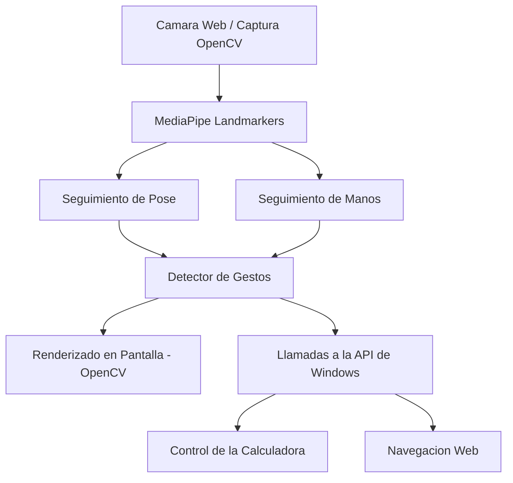

# LookThePerson

> **Detección en tiempo real de gestos corporales y de manos para Windows usando MediaPipe Tasks y OpenCV**

[](https://www.python.org/)
[](https://www.microsoft.com/windows)
[](https://developers.google.com/mediapipe)
[](https://opencv.org/)

---

## Descripcion General

**LookThePerson** es una aplicacion interactiva de vision por computadora diseñada exclusivamente para Windows. Utilizando la camara web del sistema, la aplicacion procesa en tiempo real los puntos de referencia corporales y de las manos para interactuar directamente con el sistema operativo Windows mediante gestos fisicos y comandos de teclado.

El proyecto destaca por su capacidad de automatizacion inicial, descargando los modelos preentrenados de MediaPipe en su primer arranque, y su integracion nativa con las APIs del sistema operativo para simular entradas de usuario en aplicaciones cotidianas como la calculadora de Windows y el navegador web.

---

## Flujo de Trabajo de la Aplicacion



---

## Interfaz Visual


---

## Caracteristicas Principales

*   **Seguimiento Corporal Completo:** Superposicion en tiempo real del esqueleto sobre la imagen del usuario y tintado dinamico mediante segmentacion.
*   **Seguimiento Detallado de Manos:** Trazado de los 21 puntos de referencia (landmarks) en cada mano.
*   **Descarga de Modelos Bajo Demanda:** Descarga e inicializacion automatica de los modelos de deteccion `pose_landmarker_full.task` y `hand_landmarker.task` en el primer uso.
*   **Control Domestico mediante Gestos:** Interaccion con el sistema operativo simulando acciones como abrir, controlar o cerrar la calculadora de Windows y navegar por internet.
*   **Visualizacion Adaptable:** Soporte para ejecucion en pantalla completa o en modo ventana estandar.

---

## Requisitos de Sistema

*   **Sistema Operativo:** Windows 10 u 11 (requerido para las APIs nativas de integracion).
*   **Hardware:** Camara web funcional y procesador adecuado para analisis de video en tiempo real.
*   **Entorno:** Python 3.10 o superior.

---

## Instalacion y Configuracion

### 1. Preparar el Entorno Virtual
Se recomienda utilizar un entorno virtual para aislar las dependencias del proyecto:

```powershell
# Crear el entorno virtual
python -m venv .venv

# Activar el entorno virtual
.\.venv\Scripts\activate
```

### 2. Instalar las Dependencias
Una vez activado el entorno, instala los paquetes requeridos por el script:

```powershell
pip install -r requirements.txt
```

> [!NOTE]
> Las dependencias principales declaradas en `requirements.txt` incluyen `opencv-python` y `mediapipe`.

---

## Instrucciones de Uso

Ejecuta el script principal con la configuracion por defecto:

```powershell
python hand.py
```

### Parametros de Linea de Comandos Disponibles
Puedes personalizar el comportamiento del programa utilizando argumentos al arrancar la ejecucion:

| Argumento | Tipo | Valor por Defecto | Descripcion |
| :--- | :---: | :---: | :--- |
| `--camera` | Entero | `0` | Indice de la camara de captura. |
| `--width` | Entero | `1280` | Ancho de resolucion solicitado para la captura. |
| `--height` | Entero | `720` | Alto de resolucion solicitado para la captura. |
| `--fps` | Entero | `30` | Fotogramas por segundo solicitados. |
| `--windowed` | Flag | Desactivado | Inicia la visualizacion en modo ventana en lugar de pantalla completa. |
| `--no-calculator` | Flag | Desactivado | Desactiva las acciones por gestos que controlan la calculadora. |

---

## Mapa de Controles y Gestos

### Comandos por Teclado

*   `Q` o `Esc`: Finaliza de forma segura la ejecucion de la aplicacion.
*   `X`: Bloquea o desbloquea temporalmente el control por gestos de la calculadora para evitar activaciones accidentales.

### Interaccion por Gestos Corporales y de Manos

| Gesto Detectado | Accion Ejecutada |
| :--- | :--- |
| **Aplauso rapido** | Cambia aleatoriamente el color del tintado de segmentacion corporal. |
| **Brazos extendidos / abiertos** | Abre de forma automatica la Calculadora de Windows. |
| **Brazos cruzados / cerrados** | Cierra la Calculadora de Windows. |
| **Ambas manos extendidas** | Limpia la entrada o los valores activos de la calculadora. |
| **Ambas manos levantadas** | Abre la plataforma de YouTube en el navegador predeterminado. |

---

## Notas Tecnicas de Implementacion

*   **Descarga Automatica:** En su primera ejecucion, el script detectara la ausencia de los archivos de modelo en el directorio raiz y comenzara la descarga directa desde los servidores oficiales de Google MediaPipe. 
*   **Versionamiento del Proyecto:** Debido al gran tamaño de los archivos `.task`, se recomienda no incluirlos en el control de versiones (Git) agregandolos al archivo `.gitignore` del proyecto.
*   **Dependencia del Sistema:** La ejecucion de comandos nativos de la calculadora y llamadas al navegador de Windows estan diseñadas exclusivamente para las APIs del sistema operativo de Microsoft.

---

## Archivos del Repositorio

*   [hand.py](file:///c:/Users/nostraxiten/Downloads/readmes/hand.py): Script principal encargado de la captura, procesamiento y renderizado visual.
*   `hand_landmarker.task`: Archivo de modelo para el reconocimiento y localizacion de manos (descargado automaticamente).
*   `pose_landmarker_full.task`: Archivo de modelo para el reconocimiento de postura corporal completa (descargado automaticamente).
*   `requirements.txt`: Archivo de texto que detalla las dependencias necesarias de Python.

