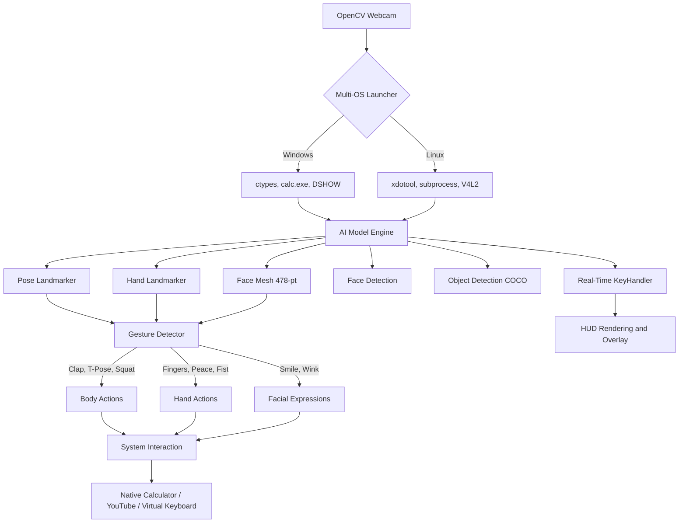

# LookThePerson

<div align="center">

</pre>

**Advanced Multi-Platform Control Framework for Computer Vision and Gestures**

[](https://www.python.org/)
[](https://www.linux.org/)
[](https://developers.google.com/mediapipe)
[](https://opencv.org/)

</div>

---

## 👁️ Overview

**LookThePerson** is a computer vision framework that transforms your webcam into a real-time control interface. Using up to **5 distinct AI models** (MediaPipe), the program simultaneously tracks your body, hands, face, and objects in your environment.

What started as a small Windows script has evolved into a highly interactive **cross-platform system (Windows and Linux)**. It enables you to activate functions, switch models on the fly, and use physical gestures to control native applications, all from a futuristic HUD interface overlaid on your camera.

---

##  Interface Demonstration

<p align="center">
  
</p>

---

##  Architecture and Flow


```mermaid
graph TD
    A[OpenCV Webcam] --> B{Multi-OS Launcher}
    B -->|Windows| C1[ctypes, calc.exe, DSHOW]
    B -->|Linux| C2[xdotool, subprocess, V4L2]
    
    C1 & C2 --> D[AI Model Engine]
    
    D --> E1[Pose Landmarker]
    D --> E2[Hand Landmarker]
    D --> E3[Face Mesh 478-pt]
    D --> E4[Face Detection]
    D --> E5[Object Detection COCO]
    
    E1 & E2 & E3 --> F[Gesture Detector]
    F -->|Clap, T-Pose, Squat| G1[Body Actions]
    F -->|Fingers, Peace, Fist| G2[Hand Actions]
    F -->|Smile, Wink| G3[Facial Expressions]
    
    G1 & G2 & G3 --> H[System Interaction]
    H --> I[Native Calculator / YouTube / Virtual Keyboard]
    
    D --> J[Real-Time KeyHandler]
    J --> K[HUD Rendering and Overlay]
```

---

##  Integrated AI Models

The tool automatically downloads these models on first startup:

| MediaPipe Model | Purpose | Extra Features |
| :--- | :--- | :--- |
| **Pose Landmarker** | Complete body skeleton | Silhouette segmentation with dynamic tinting |
| **Hand Landmarker** | 21-point tracking per hand | Finger counting and sign recognition |
| **Face Mesh** | 3D facial mesh with 478 points | Expression detection and iris/gaze tracking |
| **Face Detection** | Fast face detection | Bounding boxes and 6 key points (eyes, nose, mouth) |
| **Object Detection** | Environment recognition | 80 COCO classes with categorical colors |

---

##  Real-Time Controls (Keyboard)

You can instantly activate and deactivate features **while the camera is running**:

> [!TIP]
> **Quick Setup Modes:** Use numbers `1` through `4` to change the active model profile at once (Ex: `1` = All active, `4` = Face only).

| Key | Action / Toggle | Key | Action / Toggle |
| :---: | :--- | :---: | :--- |
| `M` | Toggle **Segmentation** body mask | `S` | Take **Screenshot** (PNG capture) |
| `F` | Enable/Disable **Face Mesh** overlay | `R` | Start/Stop **Video Recording** |
| `O` | Enable/Disable **Object Detection** | `C` | Change skeleton color (Random) |
| `D` | Enable/Disable **Fast Face Detection**| `X` | Lock/Unlock Calculator control |
| `G` | Show/Hide **Reference Grid** | `+ / -` | Adjust object detection confidence |
| `H` | Toggle **Help HUD Panel** sidebar | `1 - 4` | Switch Modes (Full/Pose/Hands/Face)|
| `T` | Show/Hide **Telemetry** text at bottom | `Q / Esc` | **Exit** program safely |
| `N` | Enable/Disable **Night Mode** (Inverted)| `B` | Hide/Show **Bounding Boxes** |

---

##  Mapped Physical Gestures

The system includes algorithmic detection of multiple body states that interact directly with the Operating System:

| Detected Gesture | Category | Action Executed on OS |
| :--- | :--- | :--- |
| **Arms extended (T-Pose)** | Body | Opens native system calculator (`calc.exe` or `gnome-calculator`) |
| **Arms crossed on chest** | Body | Closes active calculator |
| **Both hands raised** | Body | Opens new YouTube tab in browser |
| **Quick clap** | Body | Randomly changes body color |
| **Open hands (5 fingers x2)**| Hands | Clears calculator screen (Sends `Escape`) |
| **Finger counting (1-4)** | Hands | Sends corresponding number to calculator |
| **Closed fist (0 fingers)** | Hands | Sends plus symbol (`+`) to calculator |

> [!NOTE]
> New gestures available in the engine (Squat, Head touch, Winks, Smiles) are ready to be mapped to new functions in `looktheperson.py`.

---

##  Requirements and Installation

### System Prerequisites
* **Windows:** Windows 10/11.
* **Linux:** Any distro with X11/Wayland. Requires `xdotool` for window control. (`sudo apt install xdotool`)
* **Python:** 3.10+
* **Working webcam.**

### Installation

```bash
# Clone the repo
git clone https://github.com/nostraxiten/LookThePerson.git
cd LookThePerson

# Create and activate virtual environment (Recommended)
python -m venv .venv
# On Windows: .venv\Scripts\activate
# On Linux: source .venv/bin/activate

# Install dependencies
pip install -r requirements.txt
```

---

##  Execution Mode

Run the new main launcher:

```bash
python looktheperson.py
```

### Optional Arguments

| Command | Description |
| :--- | :--- |
| `--windowed` | Launches the application in a resizable window (default is fullscreen). |
| `--camera N` | Uses a different camera index if you have multiple connected (Ex: `--camera 1`). |
| `--no-calculator` | Starts with calculator lock enabled from the beginning. |
| `--fps N` | Forces a specific capture refresh rate. |
| `--width N` / `--height N` | Forces a specific camera resolution. |

---

##  Expansive Framework Structure

```text
LookThePerson/
├── looktheperson.py          # Multi-platform main launcher
├── platforms/                # System abstraction (Windows/Linux)
├── models/                   # AI Wrappers (Pose, Hands, Face, Objects)
├── gestures/                 # Gesture detection math logic
├── actions/                  # Controllers (Keys, Macros, Recording)
├── ui/                       # Rendering (HUD, Grid, Night Mode)
├── screenshots/              # Auto-generated when pressing 'S'
└── recordings/               # Auto-generated when pressing 'R'
```

---

> [!WARNING]
> **Local Privacy:** Computer vision analysis runs 100% locally and offline on your CPU. No frames are transmitted to the internet. Models are downloaded once from Google's servers.
> 
