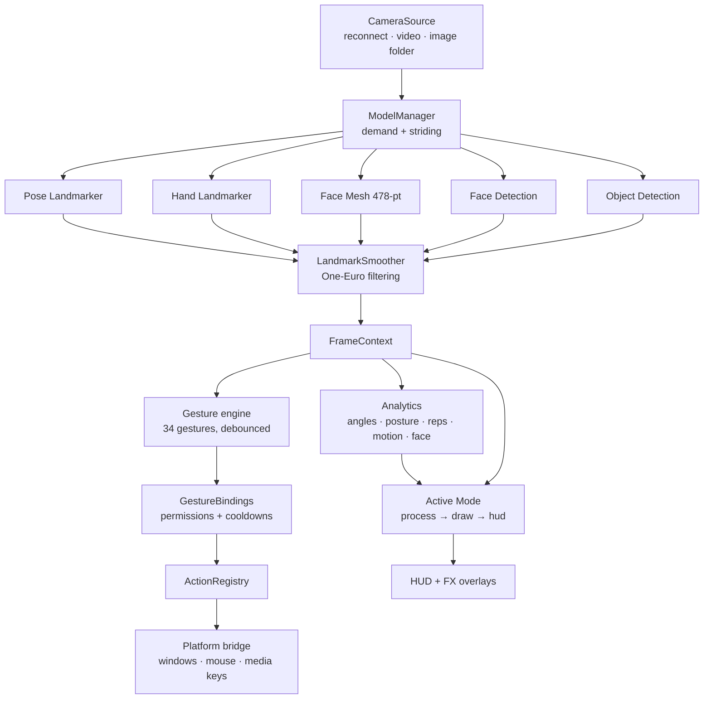

#  LookThePerson

<div align="center">

**Advanced Multi-Platform Control Framework for Computer Vision and Gestures**

[](https://www.python.org/)
[](https://www.linux.org/)
[](https://developers.google.com/mediapipe)
[](https://opencv.org/)
[](docs/FEATURES.md)
[](tests/)

</div>

---

##  Overview

**LookThePerson** turns your webcam into a real-time control and analysis
interface. Five MediaPipe models track your body, hands, face and surroundings
at once, and a **mode system** decides what to do with that information —
count your reps, correct your posture, watch for fatigue, paint in the air,
anonymise faces, or just make the video look like the Matrix.

Everything runs **locally and offline**. Models are downloaded once from
Google's servers; no frame ever leaves your machine.

---

##  Quick start

```bash
git clone https://github.com/nostraxiten/LookThePerson.git
cd LookThePerson

python -m venv .venv
# Windows: .venv\Scripts\activate
# Linux:   source .venv/bin/activate

pip install -r requirements.txt
python looktheperson.py
```

Press `TAB` for the mode picker, `H` for the full key list, `Q` to quit.

---

##  The mode system

A mode is a complete behaviour: its own processing, drawing, HUD and key
bindings. **49 of them ship built in**, in six families:

| Family | Count | Examples |
| :--- | :---: | :--- |
| **Detection** | 7 | `full`, `pose`, `hands`, `face`, `objects`, `minimal`, `crowd` |
| **Fitness** | 6 | `reps`, `workout`, `posture`, `balance`, `stretch`, `cardio` |
| **Wellness** | 5 | `drowsiness`, `focus`, `breathing`, `ergonomics`, `meditation` |
| **Creative** | 15 | `matrix`, `thermal`, `ascii`, `hologram`, `ghost`, `trails`, `heatmap` |
| **Interaction** | 6 | `airdraw`, `airmouse`, `piano`, `media`, `presentation`, `signs` |
| **Utility** | 10 | `security`, `privacy`, `greenscreen`, `photobooth`, `measure`, `benchmark` |

```bash
python looktheperson.py --list-modes      # every mode with its own keys
python looktheperson.py --mode workout    # start in one directly
```

A few worth trying first:

- **`security`** — a full surveillance station: metered night vision (IR,
  intensifier, thermal), persistent `SUJ-nn` identification that survives a
  subject walking out of frame and back, zone alarms and an exportable event
  log. It switches every decoration off and draws its own DVR display.
  See **[the security section](docs/FEATURES.md#security-mode)**.
- **`workout`** — detects squats, push-ups, curls, jumping jacks and more
  *simultaneously*. You never tell it what you are doing; sets close themselves
  after you rest, and it tracks tempo, form and calories.
- **`posture`** — grades your posture continuously and tells you the specific
  fix ("bring your chin back", "level your shoulders") only after the problem
  persists, so it never nags at a moment of fidgeting.
- **`drowsiness`** — PERCLOS fatigue monitoring, the measure used in
  driver-monitoring research, plus blink rate and yawn counting.
- **`airdraw`** — draw in the air with your index finger; pinch to lift the pen.
- **`privacy`** — blur or pixelate faces, or replace bodies with silhouettes,
  while tracking keeps working.

The full catalogue, including every analytics metric, gesture and effect, is in
**[docs/FEATURES.md](docs/FEATURES.md)**.

---

##  Architecture


```mermaid
graph TD
    A[CameraSource<br/>reconnect · video · image folder] --> B[ModelManager<br/>demand + striding]

    B --> C1[Pose Landmarker]
    B --> C2[Hand Landmarker]
    B --> C3[Face Mesh 478-pt]
    B --> C4[Face Detection]
    B --> C5[Object Detection]

    C1 & C2 & C3 & C4 & C5 --> D[LandmarkSmoother<br/>One-Euro filtering]
    D --> E[FrameContext]

    E --> F[Analytics<br/>angles · posture · reps · motion · face]
    E --> G[Gesture engine<br/>34 gestures, debounced]

    G --> H[GestureBindings<br/>permissions + cooldowns]
    H --> I[ActionRegistry]

    F & E --> J[Active Mode<br/>process → draw → hud]
    J --> K[HUD + FX overlays]
    I --> L[Platform bridge<br/>windows · mouse · media keys]
```

The frame loop contains **no feature logic**. Everything a user can see or
trigger lives in a mode, an action or an analytics class, so adding a feature
never means editing the loop.

```text
LookThePerson/
├── looktheperson.py     # CLI launcher
├── app.py               # Application pipeline and frame loop
├── core/                # Config, events, filters, geometry, metrics, theme, state
├── analytics/           # Angles, posture, reps, fitness, motion, face, identity, session
├── modes/               # The 49 modes, grouped by family (+ security/)
├── fx/                  # Filters, background effects, overlays, night vision
├── models/              # MediaPipe wrappers + ModelManager
├── gestures/            # Body, hand and face gesture engines
├── actions/             # Key handling, gesture→action bindings
├── io_utils/            # Camera input, capture (screenshots, video, GIF)
├── ui/                  # HUD, widgets, renderer
├── platforms/           # Windows and Linux bridges
└── tests/               # 1492 unit tests
```

`core/` and `analytics/` deliberately avoid importing OpenCV and MediaPipe,
which is what makes every metric directly unit-testable without a camera. The
subject tracker in `analytics/identity.py` follows the same rule, so identity
matching can be tested against synthetic skeletons alone; the image side of the
security mode lives in `fx/nightvision.py`, where OpenCV is allowed.

Landmarks reach the drawing code through one funnel — `core.geometry.to_pixels`
and the `FrameContext.px` helpers — which is where NaN and out-of-range
coordinates are absorbed. That is deliberate: the alternative is thirty call
sites each re-deriving `int(lm.x * width)` and each inheriting the same crash.

---

##  Controls

| Key | Action | Key | Action |
| :---: | :--- | :---: | :--- |
| `TAB` | Mode picker | `S` | Screenshot |
| `[` `]` | Previous / next mode | `R` | Record video |
| `1`-`9` | Jump to a mode | `G` | Record GIF |
| `H` | Help panel | `Shift+B` | Photo burst |
| `T` | Telemetry / HUD | `V` | Cycle colour theme |
| `M` | Segmentation mask | `K` | Skeleton |
| `F` | Face mesh | `D` | Face detection |
| `O` | Object detection | `N` | Night mode |
| `#` | Reference grid | `W` | Mirror |
| `Y` | FPS graph | `` ` `` | Debug info |
| `P` | Pause | `0` | Reset current mode |
| `+` `-` | Detection confidence | `Shift+S` | Save configuration |
| `Q` / `Esc` | Quit | | |

Each mode adds its own keys on top — `--list-modes` shows them, and so does the
in-app help panel.

---

## 🤸 Gestures

34 gestures are recognised across body, hands and face. Any of them can be
bound to any action:

| Gesture | Default action | | Gesture | Default action |
| :--- | :--- | --- | :--- | :--- |
| T-pose | Open calculator | | Peace sign | Screenshot |
| Arms crossed | Close calculator | | Thumbs up | Start recording |
| Both hands raised | Open browser | | Thumbs down | Stop recording |
| Clap | Change skeleton colour | | Rock sign | Next theme |
| Head touch | Screenshot | | OK sign | Next mode |
| Hands on hips | Toggle help | | Spock | Toggle grid |

Rebind them in `~/.looktheperson/config.json`:

```json
{
  "gestures": {
    "bindings": { "clap": "next_theme", "peace": "capture_gif" }
  }
}
```

Every gesture is debounced and rate-limited, and anything that reaches outside
the app (calculator, browser, mouse, media keys) is gated by an explicit
permission that is **off by default** for mouse and media control.

---

##  Configuration

Settings resolve in a fixed order, later winning: built-in defaults →
`~/.looktheperson/config.json` → `./looktheperson.json` → the selected profile →
CLI flags.

```bash
python looktheperson.py --show-config              # see what is in effect
python looktheperson.py --profile gym --save-config
python looktheperson.py --profile gym              # reuse it later
```

Profiles live inside the same file, so one config can hold a gym setup, a desk
setup and a demo setup.

---

##  Command line

| Flag | Description |
| :--- | :--- |
| `--mode NAME` | Starting mode |
| `--theme NAME` | Colour theme (`cyber`, `matrix`, `neon`, `sunset`, `mono`, `medical`, `arctic`) |
| `--camera N` | Camera index |
| `--width` / `--height` / `--fps` | Capture format |
| `--source PATH` | Use a video file or image folder instead of a camera |
| `--windowed` | Windowed instead of fullscreen |
| `--headless` | No window at all — for servers and benchmarking |
| `--max-frames N` | Process N frames and exit |
| `--no-segmentation` | Skip person masks (noticeably faster) |
| `--object-stride N` | Run heavy models every Nth frame |
| `--session-log` | Record the session and export it on exit |
| `--weight KG` / `--height-cm CM` | Body data for calories and measurements |
| `--allow-mouse` / `--allow-media` | Grant system-control permissions |
| `--list-modes` / `--list-cameras` / `--list-themes` | Discovery commands |
| `--download-models` | Fetch all models and exit |

---

##  Performance

The app adapts rather than stuttering:

- **Demand-driven models** — a model only runs if the active mode needs it.
- **Striding** — expensive models can run every Nth frame and reuse their last
  result, which is invisible for slow-changing signals like object detection.
- **One-Euro smoothing** applied once, centrally, so jitter is removed for
  every consumer at once.
- **Cached masks and lookup tables** — the vignette, duotone and ASCII filters
  precompute everything that does not change per frame.
- **A profiler in the app** — press `` ` `` for a per-stage breakdown, or run
  the `benchmark` mode to measure what each model costs on your machine.

If frame rate matters more than fidelity:

```bash
python looktheperson.py --mode pose --no-segmentation --width 640 --height 360
```

---

##  Tests

```bash
pip install pytest
python -m pytest tests/ -q     # 1492 tests, ~14 seconds
```

The suite runs without a camera or any model download: synthetic skeletons,
hands and face meshes drive the real analytics code.

- **`test_core`, `test_analytics`, `test_modes`** — the metrics, the gesture
  engine and one full frame cycle per mode.
- **`test_robustness`** — every mode against fourteen kinds of malformed input:
  NaN landmarks, coordinates far outside the frame, truncated landmark lists,
  collapsed skeletons, 1-pixel and 3-pixel-wide frames, mismatched segmentation
  masks, out-of-bounds detector boxes and non-contiguous frame views. Plus every
  keycode, every theme, and both extremes of the toggle space.
- **`test_security`** — the surveillance mode: that an identity survives a
  subject leaving and re-entering, that a subject outside the armed zone raises
  nothing, and that night-vision metering does not flap at dusk.

A frame that makes a mode raise ends the session and loses the recording, so
the robustness suite treats "does not crash on bad input" as a feature with
tests, not an assumption.

---

##  Requirements

- **Python** 3.10+
- **Windows** 10/11, or **Linux** with X11 (`sudo apt install xdotool` for
  window and media-key control)
- A working webcam — or any video file, via `--source`

---

> [!WARNING]
> **Local privacy:** all computer-vision analysis runs 100% locally and offline
> on your CPU. No frames are transmitted anywhere. Models are downloaded once
> from Google's servers. Session logging is opt-in (`--session-log`), and
> mouse and media-key control are disabled unless you explicitly enable them.

<div align="center">

by **Nox** / [@nostraxiten](https://github.com/nostraxiten)

</div>
